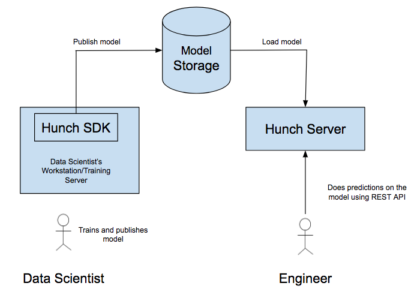

# Hunch
Hunch allows users to turn arbitrary machine learning models built using Python into a scalable, hosted service. Simply put, a data scientist can now focus on building the model and Hunch takes care of turning this model into a REST API.

## Hunch Quick Start Guide 
This guide helps you setup Hunch on local machine. 
### Installation
- Download Anaconda configuration file from [osx_environment.yml](documentation/docs/resources/osx_environment.yml)/[linux_environment.yml](documentation/docs/resources/linux_environment.yml). Setup conda environment using the following commands. 
```sh
  conda env create -f osx_environment.yml -n hunch
  # To activate hunch environment, run the following command.
  source activate hunch
  # To deactivate hunch environment, run the following command. 
  # source deactivate hunch
```
- Latest Hunch SDK can be downloaded from [here](documentation/docs/resources/hunch-0.0.1.tar.gz).
- Install Hunch SDK using the following command. 
```sh 
   pip install -v --upgrade --no-deps --disable-pip-version-check hunch-0.0.1.tar.gz
```
### Client Configuration
Set environment variable HUNCH_API_CONFIG to Hunch SDK client config file path. Refer `Hello World` example below. 
Typical configuration file looks like the following...        

hunch_api_config.yaml
```yaml
model_storage:
  backend: "local_fs"
  local_fs:
    modelrepo_dir: "/tmp/model_repo" # This should be created before publishing the model 
```
### Hello World Example 
```python
import json
import os
from hunchsdk.HunchApi import HunchApi

os.environ["HUNCH_API_CONFIG"]="hunch_api_config.yaml"

class HelloWorldModel:
    def predict(self, input):
        return json.dumps("Hello World")

model = HelloWorldModel()
print "Local Prediction:", model.predict(None)
HunchApi().publish_model(model, "HelloWorldExample", "1.0.0") 

# Expected Result
# Local Prediction: "Hello World"
```
### Server Configuration 
hunch_server_config.yaml     
```yaml
rotation_status_file: "/tmp/rotation_status"  
model_storage:
  backend: "local_fs"
  local_fs:
    modelrepo_dir: "/tmp/model_repo" # This directory should exist 
model_loader:
  working_dir: "/tmp" 
custom_package_deployer:
  working_dir: "/tmp/hunchsdk_custom_libs" # This directory should exist 
```
### Start Hunch 
Use the following command...  

Refer [gunicorn](http://docs.gunicorn.org/en/stable/settings.html) documentation for more details and options available. 
   
```sh
gunicorn -b 0.0.0.0:8000 -w 10 --preload --pid model_server.pid  --timeout 300 -e  MODEL_SIZE_THRESHOLD=2000000000 -e HUNCH_CONFIG="hunch_server_config.yaml" -e MODELS_TO_LOAD="[[\"HelloWorldExample\", \"1.0.0\"]]" hunch_server.wsgi:app --daemon
```

### Predict using POST API
This model can be invoked via REST API as follows. 
```python
import requests
import json

model_server_url = "http://localhost:8000/predict"
params = {"model_id":"HelloWorldExample", "model_version":"1.0.0"}
data = json.dumps(None)
response = requests.post(model_server_url, params = params, json = data)
print "Result:", response.content

# Expected Output
# Result: {"stack_trace": "NA", "result": "\"Hello World\""}
```
### Stopping Hunch 
Get pid from `model_server.pid` and use the following command to kill. 
```sh
sudo kill -9 <pid>
```

 
## Hunch Detailed User Guide
### End-to-End Workflow
Here is the end-to-end workflow w.r.t using Hunch.


1. Data scientists install the python Hunch SDK (model publisher earlier) package on their workstation or any instance where models are being trained (we will refer to this as the local environment).
2. Data scientists build/train a model which typically comprises of one or more objects from a standard ML libraries like Scikit-Learn, Tensorflow etc. At this point it is possible to make predictions in the local environment.
3. Data scientists implement a Python class that contains all the objects required to make predictions using the model. This class is required to have a method called `predict` which accepts a JSON input and produces a JSON output (which is the prediction) using the objects which are the building blocks of the model. We will refer to this class as the model class.
4. Data scientists publish the model to the Blob Storage using an instance of the model class using HunchApi in Hunch SDK. This method expects model identifier and model version. Model version management is automated once Model Repository is integrated. 
5. Developers can now use the model as a REST API. That is, they can simply call a REST API with the MODEL identifier (and version) pass a JSON object which is the input to the model and receive the output of the model as a JSON object.

### Installation
- Download Anaconda configuration file from [osx_environment.yml](documentation/docs/resources/osx_environment.yml)/[linux_environment.yml](documentation/docs/resources/linux_environment.yml). Setup conda environment using the following commands. 
```sh
  conda env create -f osx_environment.yml -n hunch
  # To activate hunch environment, run the following command.
  source activate hunch
  # To deactivate hunch environment, run the following command. 
  source deactivate hunch
```
- Latest Hunch SDK can be downloaded from [here](documentation/docs/resources/hunch-0.0.1.tar.gz).
- Install Hunch SDK using the following command. 
```sh 
   pip install -v --upgrade --no-deps --disable-pip-version-check hunch-0.0.1.tar.gz
```
### Client Configuration
Set environment variable HUNCH_API_CONFIG to Hunch SDK client config file path. 
For eg.

```python
os.environ["HUNCH_API_CONFIG"]="hunch_api_config.yaml"
```

Typical configuration file looks like the following... 

```yaml
model_storage:                                # For more details on Model storage configuration refer "Model Blob Storage" section of this document. 
  backend: "local_fs"                         # Name of the blob storage backend. For ex: local_fs, s3, azure_blob_storage etc. 
  local_fs:                                   # Local File System backed configuration
    modelrepo_dir: "/tmp/model_repo"          # Directory which you want to use for storing models.
  s3:                                         # S3 configuration is not really needed in this configuration as we are using local_fs based storage client. This is added as a reference. 
    access_key: "AccessKey"                   # S3 Account Access key 
    bucket: "S3Bucket"                        # S3 bucket 
    chunk_size: 134217728                     # S3 chunk size to be used in multi part upload
    endpoint: "S3 Endpoint"                   # S3 endpoint 
    max_error_retry: 5                        # How many retry attempts on failure? 
    secret_key: "SecretKey"                   # S3 Account Secret Key 
    size_limit: 209715100                     # If the size of the blob is greater than size_limit then multi part upload is used. 
```

### Server Configuration 
Typical Server configuration looks like the following ...

```yaml
rotation_status_file: "/tmp/rotation_status"      # Used in taking Hunch out of rotation and brnging Hunch back in rotation. The app should have write permissions to this fiel/dir. 
model_storage:                                    # For more details on Model storage configuration refer "Model Blob Storage" section of this document. 
  backend: "local_fs"                             # Name of the blob storage backend. For ex: local_fs, s3, azure_blob_storage etc.
  local_fs:                                       
    modelrepo_dir: "/tmp/model_repo"              # Directory which you want to use for storing models.
s3:                                         # S3 configuration is not really needed in this configuration as we are using local_fs based storage client. This is added as a reference. 
    access_key: "AccessKey"                   # S3 Account Access key 
    bucket: "S3Bucket"                        # S3 bucket 
    chunk_size: 134217728                     # S3 chunk size to be used in multi part upload
    endpoint: "S3 Endpoint"                   # S3 endpoint 
    max_error_retry: 5                        # How many retry attempts on failure? 
    secret_key: "SecretKey"                   # S3 Account Secret Key 
    size_limit: 209715100                     # If the size of the blob is greater than size_limit then multi part upload is used. 
model_loader:                         
  working_dir: "/tmp"                         # Directory in which you want to write temporary files while loading models in Hunch
custom_package_deployer:
  working_dir: "/tmp/hunchsdk_custom_libs"       # This directory should exist. Custom packages needed by models are installed into this directory. 
```

### Model Serialization and Publish APIs 
#### Using Cloudpickle serialization: 
[Cloudpickle](https://github.com/cloudpipe/cloudpickle) is used for the serialization of models.    
Usage is explained with the following set of examples.   

##### Hello World
Let us start with a very simple dummy model which we will call `HelloWorldModel`. This model simply returns the string `Hello World` on any (or no) input. The listing below illustrates the complete source code for publishing the model.

Note the following points.

1. We import the `json` package for processing JSON.
2. We import the `hunchsdk.HunchApi` package.
3. We define a class called `HelloWorldModel`.
4. The class `HelloWorldModel` implements the `predict` method which accepts `input` which should be JSON object(or should be JSON serializable/deserializable) and returns a JSON object(or should be JSON serializable/deserializable) which simply contains the string `Hello World`.
5. We create an instance of the `HelloWorldModel` class.
6. We create an instance of the `HunchApi` class.
7. We print the output produced by the `predict` method.
8. We publish the model using the `publish_model` method that takes an instance of the model, model id and model version. Model ID and Version management will be automated once the integration with Model Repository is available. 
    
###### publish_model API documentation:           
```python
HunchApi().publish_model(model_instance,              # Required. Instance of the model class.              
                model_id,                          # Required. Model ID. This is given by the user and not autogenerated. Autogeneration will be enabled after the integration of Model Repository            
                model_version,                     # Required. Model Version. This is given by the user and not autogenerated. Autogeneration will be enabled after the integration of Model Repository             
                path_to_setup_py,                  # Optional. Path to setup.py of the custom package which the model is dependent on. 
                custom_package_name                # Optional. Name of the custom package which the model is dependent on. 
                )           
```
    

```python
import json

from hunchsdk.HunchApi import HunchApi


class HelloWorldModel:
    def predict(self, input):
        return json.dumps("Hello World")

model = HelloWorldModel()
print "Local Prediction:", model.predict(None)
HunchApi().publish_model(model, "HelloWorldExample", "1.0.0")

# Expected Result
# Local Prediction: "Hello World"
```

###### Starting Hunch 

Refer [gunicorn](http://docs.gunicorn.org/en/stable/settings.html) documentation for more details and options available. 

```sh
gunicorn -b 0.0.0.0:8000 -w 10 --pid model_server.pid  --timeout 300  --log-config gunicorn_log.conf --access-logformat "%(h)s %(t)s %(r)s %(s)s %(D)s" -e  MODEL_SIZE_THRESHOLD=2000000000 -e HUNCH_CONFIG="hunch_server_config.yaml" -e MODELS_TO_LOAD="[[\"HelloWorldExample\", \"1.0.0\"]]" hunch_server.wsgi:app --daemon
```
`MODEL_SIZE_THRESHOLD`: Model size threshold beyond which the models will not load. This is used as a gaurdrail to prevent users from loading large models by mistake (For ex. Adding training dataset in the model). 
`HUNCH_CONFIG`: Hunch server configuration explained above. This yaml file should exist for Hunch to start successfully. 
`MODELS_TO_LOAD`: List of models to load. This has to be a list of model id and mdoel version pairs (This pair itself is a list) serialized as JSON string. Ex: "[[\"HelloWorldExample\", \"1.0.0\"], [\"SkLearnExample\", \"1.0.0\"]]"

###### Stopping Hunch 
Get pid from `model_server.pid` and use the following command to kill. 
```sh
sudo kill -9 <pid>
```

###### Prediction on HelloWorldModel
Let us now look at how a developer can use `HelloWorldModel`. The only communication between the data scientist and the developer is the model identifier and the model version.

Note the following points.

1. We use the `requests` package for making REST API calls and `json` package for JSON processing.
2. The model server URL is specified, a different IP address is available for staging and production.
3. A call is made using `post` where the model identifier and version are provided as parameters and the input to the model is sent as a JSON payload.
4. The rest API returns the exact result as was returned by the `predict` call invoked locally.

```python
import requests
import json

model_server_url = "http://localhost:8000/predict"
params = {"model_id":"HelloWorldExample", "model_version":"1.0.0"}
data = json.dumps(None)
response = requests.post(model_server_url, params = params, json = data)
print "Result:", response.content

# Expected Output
# Result: {"stack_trace": "NA", "result": "\"Hello World\""}
```

##### Models with Internal State

Let us now consider another model with an internal state. The listing below illustrates a model that simply adds a given number to the input number.

The following points should be noted.

1. The `AddNumber` model has the required `predict` that adds a number in `self.number_to_add` to the given input and returns the result of this operation.
2. The `AddNumber` models has another method called `number_to_add` which can be used to set the value of `self.number_to_add`.
3. We initialize the value of `self.number_to_add` before the model is exported.

###### Publish Model
```python
import json

from hunchsdk.HunchApi import HunchApi


class AddNumber:
    def number_to_add(self, number_to_add):
        self.number_to_add = number_to_add
    def predict(self, input):
        input_number = input["input"]
        return self.number_to_add + input_number

model = AddNumber()
model.number_to_add(42)
print "Local Prediction:", model.predict({"input":1})
HunchApi().publish_model(model, "AddNumber", "1.0.0")

# Expected Result
# Local Prediction: 43
```
###### Load model and start Hunch
Stop Hunch and then load `AddNumber` model and `Helloworld` model by using the following command. 
```sh
gunicorn -b 0.0.0.0:8000 -w 10 --pid model_server.pid  --timeout 300  --log-config gunicorn_log.conf --access-logformat "%(h)s %(t)s %(r)s %(s)s %(D)s" -e  MODEL_SIZE_THRESHOLD=2000000000 -e HUNCH_CONFIG="hunch_server_config.yaml" -e MODELS_TO_LOAD="[[\"HelloWorldExample\", \"1.0.0\"],[\"AddNumber\", \"1.0.0\"]]" hunch_server.wsgi:app --daemon
```

###### Prediction 
This model can be invoked via REST API as follows.
 ```python
 import requests
 import json
 
 model_server_url = "http://localhost:8000/predict"
 params = {"model_id":"AddNumber", "model_version":"1.0.0"}
 data = {"input":1}
 response = requests.post(model_server_url, params = params, json = data)
 print "Result:", response.content
 
 # Expected Output
 # Result: {"stack_trace": "NA", "result": "43"}
 ```

##### Using Scikit-Learn

Let us now consider an example where a ML model built with Scikit-Learn can be exported and predictions made via a REST API. The listing below illustrates training a Support Vector Machine on the Digits dataset. The following points are to be noted.

1. As before we implement a `Model` class with a `predict` method.
2. We add two helper methods to this class namely `train` and `predict_local`. As the name indicates there are for training the model and making local predictions.
3. The `train` method is set up to receive the training data as two parameters `training_data_X` (the input) and `training_data_Y` (the output).
4. The train method initializes the `Normalizer` class for preprocessing the data and the `SVC` class (which is the model to be trained) from Scikit-Learn. These are declared as class variables (`self.normalizer` and `self.svc`) as we need this instances to make predictions.
5. The `SVC` class is initialized with the hyper-parameters `svm.SVC(gamma=0.001, C=100.)`.
6. The input data is normalized using `normalizer.fit_transform` which both normalizes the data and stores the mean and the variance as the internal state of the instance. The result of `normalizer.fit_transform` is stored in `normalised_training_data_X` which is a local variable as we do not need this to make predictions, we only need this during training.
7. The Support Vector Machine is trained using the `svc.fit` method which trains on the input data and stores the model parameters as internal state (in the instance).
8. Post the declaration of the `Model` class, we prepare the training data and pick one example for local prediction, this is to check if the hosted model is producing the same result.
9. We then train the model using the `train` method declared earlier, make a local prediction and export the model. As before this returns a model identifier and model version.
10. The only difference between the `predict` and `predict_local` method is that the former expects a numpy array and the later expects a JSON object.

##### Publish Model
```python
import numpy
import simplejson
from sklearn import datasets
from sklearn import svm
from sklearn.preprocessing import Normalizer

from hunchsdk.HunchApi import HunchApi


class Model:
    def train(self, training_data_X, training_data_Y):
        self.normalizer = Normalizer()
        self.svc = svm.SVC(gamma=0.001, C=100.)
        normalised_training_data_X = self.normalizer.fit_transform(training_data_X)
        self.svc.fit(normalised_training_data_X, training_data_Y)

    def predict(self, given_input):
        input_for_prediction = numpy.array(simplejson.loads(given_input))
        prediction = self.svc.predict(self.normalizer.fit_transform(input_for_prediction))
        return simplejson.dumps(prediction.tolist())

    def predict_local(self, given_input):
        prediction = self.svc.predict(self.normalizer.fit_transform(given_input))
        return prediction


# Prepare the dataset
digits = datasets.load_digits()
training_data_X = digits.data
training_data_Y = digits.target

# Pick an example for local prediction
test_data_X = digits.data[-1:]
test_data_Y = digits.target[-1:]

# Train the model and make a local prediction
model = Model()
model.train(training_data_X, training_data_Y)
print "Local Prediction: ", model.predict_local(test_data_X)
print "Actual Label:", test_data_Y

# Publish the model
HunchApi().publish_model(model, "SkLearnExample", "1.0.0")

# Expected Output
# Local Prediction:  [8]
# Actual Label: [8]
```       

###### Load Model and Start Hunch
Stop Hunch and then load `AddNumber` model, `Helloworld` model and `SkLearnExample` model by using the following command. 
```sh
gunicorn -b 0.0.0.0:8000 -w 10 --pid model_server.pid  --timeout 300  --log-config gunicorn_log.conf --access-logformat "%(h)s %(t)s %(r)s %(s)s %(D)s" -e  MODEL_SIZE_THRESHOLD=2000000000 -e HUNCH_CONFIG="hunch_server_config.yaml" -e MODELS_TO_LOAD="[[\"HelloWorldExample\", \"1.0.0\"],[\"AddNumber\", \"1.0.0\"],[\"SkLearnExample\", \"1.0.0\"]]" hunch_server.wsgi:app --daemon
```
###### Predict 
This model can be invoked via REST API as follows. Note that the output of the local prediction and the hosted prediction is identical.
```python

import requests
import simplejson

# Pick one example for prediction
from sklearn import datasets
digits = datasets.load_digits()
test_data_X = digits.data[-1:]

model_server_url = "http://localhost:8000/predict"
params = {"model_id":"SkLearnExample", "model_version":"1.0.0"}
data = simplejson.dumps(test_data_X.tolist())
response = requests.post(model_server_url, params = params, json = data)
print "Result:", response.content

# Expected Output
# Result: {"stack_trace": "NA", "result": "[8]"}
```

#### Using framework provided serialization and model resources: 
Models are Python objects but not all Python objects are pure-Python objects, in certain cases they contain native (C, C++, Fortran) data structures. 
Such objects or models are  not serializable using cloudpickle. Eg: Models built using frameworks like Tensorflow, Fasttext, Crf, Caffe etc.
This document describes how to go about publishing models which are built using libraries which can't be pickled.
Typically, these libraries provide support for loading and saving the model of interest.

##### Steps
Read through this small write up, thereafter we will walk through an example. The example will clear up any haze, regarding publishing 
 such models.

##### Prediction Module

1. In python world, any .py file is called a module. You will have to create a prediction module (this can't be done in a notebook). 
2. Prediction module is where you write the model class, which implements the predict functionality.
3. Along with model class, you are required to implement a load_model method, as described below.
4. We also recommend writing a publish.py file and publish using that rather than using the jupyter notebook.

##### load_model method

1. Apart from the Model class, you'll have to implement a load_model method, which returns the instance of your model. This method is outside of the model class. 
    1. Since the instance of your model is not serializable (dumps function from libs like pickle, json etc won't work 
    because model built using libs like tensorflow are not pure python objects.)
2. Argument to this method is the top level directory, where all the files/directories required to load the model are present. All other files/directories which facilitate 
prediction/inference, should also reside here . Eg: a vocabulary saved in a separate json file or an embeddings file etc.
3. load_model is the method where you should load these meta files and pass them to your
     Model class.
3. Within the load_model method resolve to the actual paths of these files.
4. The load_model method should only take one argument that is the aforementioned top level directory.       


##### Example
Consider I have stored all my model files and other resources in a top level dir called "model_resource". Within this dir
say I have a directory named "saved_model", where I have asked the learning framework (eg: tensorflow, crf, fasttext etc) to save the model. 
I also have a "aux_data" directory where I keep other supplementary data required for predictions, in this case they are dumped python dictionaries. 

```
model_resource
├── saved_model                # This where I asked my framework to save the model.
│   ├── model_file.1
│   ├── model_file.2
│   ├── model.index
│   └── model.meta
└── aux_data          # This is where I have kept other resources required by the model. In my case a bunch of json dictionaries.
    ├── email_vocab.json
    ├── name_vocab.json
    └── order_browse_vocab.json

```

Now, let's walk you through a dummy implementation of the prediction module, using the above directory structure as an example. Let me call the prediction 
module as my_prediction_module.py

```python 
from hunchsdk.HunchApi import HunchApi
import ... # other imports
.
.
# these can be your custom libs as well. custom libs work as before.
.
.
def load_model(path_to_model_resource):
    '''
    This function loads the models and other supplementary objects which the prediction function requires.
    
    Inputs:
    - path_to_model_resources_dir: Path to the top level directory which contains the saved model and other required objects.  
    '''
    # Prepare your model
    
    # because path_to_model_resource is the top level directory
    path_to_saved_model = path_to_model_resources_dir + '/saved_model' 
    model = your_fav_framework.load_model(path_to_saved_model)
    
    # You might require objects other than your model
    path_to_email_vocab = path_to_model_resources_dir + '/aux_data/email_vocab.json'
    email_vocab = json.load(path_to_email_vocab)
    
    path_to_name_vocab = path_to_model_resources_dir + '/aux_data/name_vocab.json'
    name_vocab = json.load(path_to_name_vocab)
    
    path_to_order_browse_vocab = path_to_model_resources_dir + '/aux_data/order_browse_vocab.json'
    order_browse_vocab = json.load(path_to_order_browse_vocab)
    
    .
    .
    .
    
    return Model(model, email_vocab, name_vocab, order_browse_vocab)
    
class Model:
    
    def __init__(self, model, email_vocab, name_vocab, order_browse_vocab):
        self.model = model
        self.email_vocab = email_vocab  
        self.name_vocab = name_vocab
        self.order_browse_vocab = order_browse_vocab
       
    def predict(self, given_input):
       
        .
        .
        .
        
        return self.model.predict(given_input)   
```

##### Locally Test the load_model method
Just as a test, assume the "model_resource" directory was kept in my home directory, now if I call the load_model method in a python interpreter with appropriate 
path, it shall return an instance of the Model class. You might want to add my_prediction_module.py to the PYTHONPATH. You might also want to add the directory
where your custom code resides, if you are using custom code.


```
>>> import sys
>>> sys.path.append(path_to_direcory_of_my_prediction_module.py)
>>> sys.path.append(path_to_directory_of_custom_code)
>>> from my_prediction_module import load_model
>>> model_instance = load_model(path_to_model_resource='/home/mlplatform/model_resource')
>>> type(model_instance)
<type 'Model'>
>>> model_instance.predict(some_input) # you should be able to call predict and see it
```

If above snippet runs well, we are good to publish.
 
##### Publish model through hunchsdk
API to publish a model:
```
from hunchsdk.HunchApi import HunchApi
mlp_client = HunchApi() 
path_to_prediction_module, path_to_model_resources_dir, model_id, model_version, path_to_setup_py=None, custom_package_name=None
mlp_client.hunch_publish_new_asm_model(
            path_to_prediction_module,                    # Required, Path to prediction module
            path_to_model_resources_dir,                  # Required, This should be the same as the load_model's arguement
            model_id,                                     # Required, Model Id. This is not auto generated. Auto generation will be enabled once the integration with Model Repository is complete. 
            model_version,                                # Required, Model Version. This is not auto generated. Auto generation will be enabled once the integration with Model Repository is complete. 
            path_to_setup_py,                             # Optional. Path to setup.py of the custom package on which the model is dependent. 
            custom_package_name                           # Optional. Name of the custom package on which the model is dependent. 
        )
```

### Tensorflow Caveats 
### Do's and Don'ts while publishing tensorflow, keras (tensorflow backend) model

### When saving the model using tensorflow, Use relative paths

First of all, read through the above section. Which explains the recommended directory structure for tensorflow type models. Acquaint yourself with the model resource directory.
When using the saver.save() method, make sure the path, where you want to store the checkpoints is relative and not absolute.
````python
import tensorflow as tf
sess = tf.Session()
saver = tf.train.Saver() 
saver.save(sess, "relative-path-to-the-checkpoint-file")
````

To make sure that everything has worked fine, open the checkpoint file generated by tensorflow and you should not find any absolute  paths
there. Example.

```text
model_checkpoint_path: "model.ckpt-20550"
all_model_checkpoint_paths: "model.ckpt-20550"
```


### Don't define variable and the session in the default graph

#### Variables

Make sure all the variables you define are not defined in the default graph. For example


````
import tensorflow as tf

with tf.name_scope('embeddings'):
    store_embedding = tf.get_variable("store_embedding", [vocab_size, embed_size])
    name_embedding = tf.get_variable("name_embedding", [name_vocab_size, char_embed_size])
    email_embedding = tf.get_variable("email_embedding", [email_vocab_size, char_embed_size])
````

When ever the variables are defined, they shouldn't be defined in the default graph  as shown above. Make sure to explicitly create
a tensorflow graph object and define the variables inside it.


````
import tensorflow as tf
model_graph = tf.Graph()
with model_graph.as_default():
    with tf.name_scope('embeddings'):
        store_embedding = tf.get_variable("store_embedding", [vocab_size, embed_size])
        name_embedding = tf.get_variable("name_embedding", [name_vocab_size, char_embed_size])
        email_embedding = tf.get_variable("email_embedding", [email_vocab_size, char_embed_size])
````

Any variable defined, by default is a member of the default computational graph. Since, hunch host's multiple 
models at once. It's mandatory to define these variables in a computational graph,  solely owned by your model and there are no conflicts 
with models from other teams.


#### Sessions

Make sure to 

1. Construct your session 
2. Initialize global variables 
3. Restore the checkpoints

Using the same graph you have used to define variables. 

As follows

````
# the model_graph is the same as above
sess = tf.Session(graph=model_graph)
with model_graph.as_default():
    tf.global_variables_initializer().run(session=sess)
    saver = tf.train.Saver()
    saver.save()
    saver.restore(sess, tf.train.latest_checkpoint(model_path))
````

### Predict using POST API 
```python
import requests
import json

model_server_url = "http://localhost:8000/predict"
params = {"model_id":"HelloWorldExample", "model_version":"1.0.0"}
data = json.dumps(None)
response = requests.post(model_server_url, params = params, json = data)
print "Result:", response.content

# Expected Output
# Result: {"stack_trace": "NA", "result": "\"Hello World\""}
```

## Developer Documentation 
### Building package 
Run the following command to create a package. This command has to be run from the directory where setup.py is available. 
```sh
python setup.py sdist
```
### Model Blob Storage: 
Models can be stored in any blob storage like S3, Azure Blob Storage etc. Hunch has support for S3 and Local File System based storage. 
Users can add support to any blob storage by implementing storage_client module.  

Implement the following class and add it to hunchsdk/storage_clients/<blob_storage_name>. 
```python
class StorageClient(object):
    def __init__(self, storage_client_config):
        pass

    def get_model_blob(self, model_id, model_version):
        """
        Returns model blob for the given model id and model version
        Args:
            model_id:
            model_version:

        Returns:

        """
        pass

    def write_model_blob(self, model_blob, model_id, model_version):
        """
        Write model blob with the given model id and model version to Model Repository storage.
        Args:
            model_blob:
            model_id:
            model_version:

        Returns:

        """
        pass
```

Configuration required for your blob storage can be passed with storage_client_config as dict. 

### Documentation 

Documentation is available as markdown files. You can host documents using [mkdocs](http://www.mkdocs.org/) as well.   

- Install mkdocs.
- Go to documentation and run the following command to generate static pages needed for the site. 
```sh
mkdocs build
``` 
- Go to documentation and run the following command to host documents and serve them. 
```sh
mkdocs serve
``` 

## Core Contributors 
Vikas Garg ([@vikasgarg1996](https://github.com/vikasgarg1996))
Roshan Nair ([@roshan-nair](https://github.com/roshan-nair))
Karan Verma ([@karan10111](https://github.com/karan10111))
Naresh Sankapelly ([@nareshsankapellyfkrt](https://github.com/nareshsankapellyfkrt))
Adeel Zafar ([@adzafar](https://github.com/adzafar))


